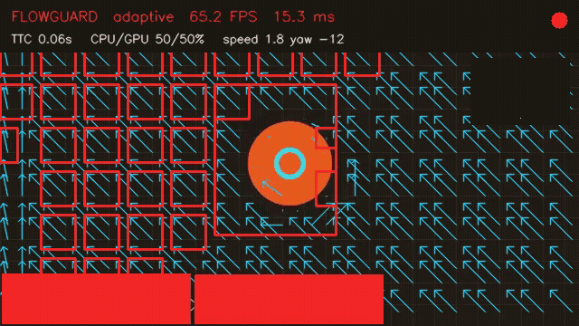
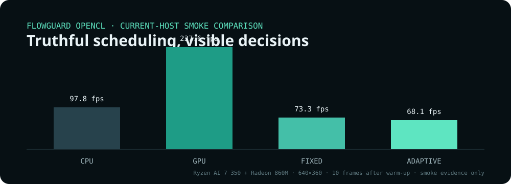

# FlowGuard OpenCL

Visual collision awareness and simulated avoidance for a kinematic drone, with the
same perception workload scheduled across OpenCL CPU and GPU devices.

FlowGuard turns a small heterogeneous-computing experiment into a closed-loop
system you can see and measure. Blender renders a deterministic first-person
flight, the C++ engine estimates image motion without simulator ground truth, and
the controller steers or brakes before a collision. Native and browser dashboards
show what the system sees, decides, and spends time on.

> FlowGuard is a research prototype with simulated avoidance. It is not a
> safety-certified flight controller.





## What is implemented

- Blender 4.5 LTS kinematic simulation at 30 Hz and 640×360, with six seeded scenarios.
- Length-prefixed, loopback-only TCP frames and versioned command messages.
- OpenCL grayscale, 3×3 Gaussian filter, three-level pyramid, and coarse-to-fine
  16×16 block matching with a ±6-pixel search at every level.
- Best/second-best confidence rejection, weighted affine motion, focus of
  expansion, radial TTC proxies, spatial clusters, and left/centre/right risk.
- Smoothed 2 m/s, ±60°/s avoidance with 3 m/s² braking and turn hysteresis.
- CPU-only, GPU-only, fixed heterogeneous, and adaptive heterogeneous modes.
- OpenCV live dashboard and recording, plus a React/TypeScript live/replay dashboard.
- JSONL telemetry, annotated MP4, CSV benchmark results, metadata, and static reports.

Ground truth lives in `Telemetry::evaluation` and is used only when recording
outcomes. Perception and control APIs cannot accept it.

## Quick start

Install the platform packages from [the setup guide](docs/SETUP.md), then build:

```bash
cmake -S . -B build -G Ninja -DCMAKE_BUILD_TYPE=Release -DBUILD_TESTING=ON
cmake --build build
ctest --test-dir build --output-on-failure

cd web
npm ci
npm run build
cd ..
```

Inspect exactly which OpenCL devices FlowGuard can use:

```bash
build/flowguard devices
```

Run a synthetic replay first:

```bash
build/flowguard replay --synthetic expanding --frames 120 --mode cpu --dashboard native --record
```

Then launch the closed-loop Blender corridor scenario. Blender starts headlessly by
default; add `--visible` to see its window.

```bash
build/flowguard simulate --scenario corridor --mode adaptive --dashboard native,web --record
```

The local web dashboard is available at `http://127.0.0.1:8080` when enabled.

## CLI

```text
flowguard devices
flowguard simulate --scenario corridor --mode adaptive --dashboard native,web --record
flowguard replay --input flight.mp4 --mode fixed --gpu-ratio 0.70
flowguard benchmark --suite default --modes cpu,gpu,fixed,adaptive --repeats 5
flowguard report --run artifacts/<run-id>
```

Simulation scenarios are `frontal-wall`, `offset-pillar`, `doorway`, `corridor`,
`safe-lateral-pass`, and `crossing-obstacle`. Warning thresholds default to 3.0
seconds (yellow) and 1.5 seconds (red); use `--yellow-ttc` and `--red-ttc` to change
them.

## Honest benchmarking

`flowguard benchmark` creates the deterministic frame sequence once, runs each mode
sequentially, excludes one warm-up frame, and disables visualization. Its CSV
contains throughput, p50/p95/p99 latency, and 33.3 ms deadline misses. Metadata
states the input and measurement boundary.

The included current-host chart is a ten-measured-frame smoke comparison, not a
stable performance study or edge-device result. The retained CSV is in
[`benchmarks/current`](benchmarks/current/ryzen-ai-7-350-radeon-860m/README.md).
The only historical Intel logs are preserved in
[`benchmarks/legacy`](benchmarks/legacy/README.md). They are labelled as legacy raw
evidence, and the old unsupported speedup headline has been removed.

Performance acceptance means reporting every mode truthfully. Adaptive mode is not
assumed to win, especially on an integrated GPU sharing memory with the CPU.

## Architecture

```text
CLI / OpenCV UI / React UI / Blender transport
                         ↓
                  frame orchestration
                         ↓
           perception → risk → control
                  ↕ scheduling policy
                         ↓
           OpenCL / OpenCV / TCP / artifacts
```

See [architecture](docs/ARCHITECTURE.md), [simulator protocol](docs/PROTOCOL.md),
and the [versioned telemetry schema](docs/telemetry.schema.json) for the precise
contracts.

## Limits and edge-device roadmap

Version 1 uses visual expansion and block motion, not depth sensors or aerodynamic
flight physics. Blender render time and perception time are separate. Results from
the current Ryzen AI 7 350/Radeon 860M machine must never be relabelled as Jetson,
Raspberry Pi, embedded, or real-drone performance.

The post-v1 deployment milestone is documented in [ROADMAP.md](ROADMAP.md). It
requires real-device selection, lower-resolution presets, power measurements where
available, and new device-labelled reports before making any edge claim.

## License

MIT © 2026 Abbe. See [LICENSE](LICENSE).
